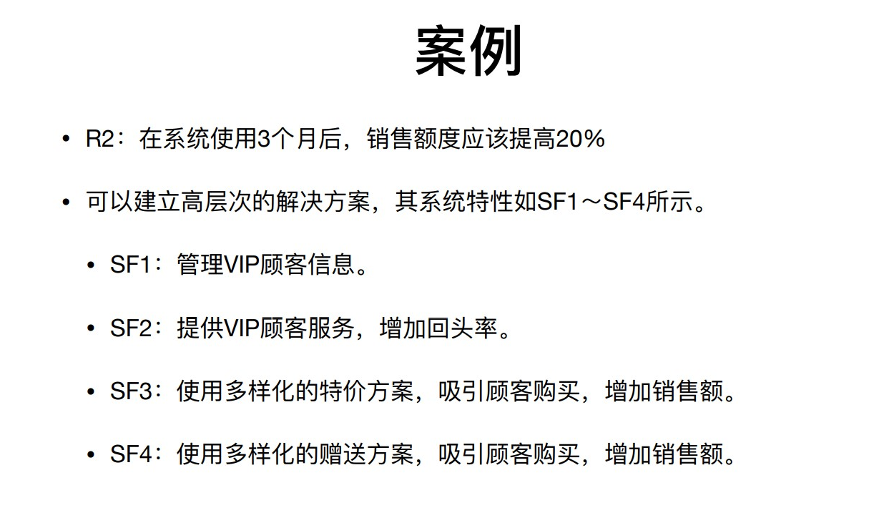
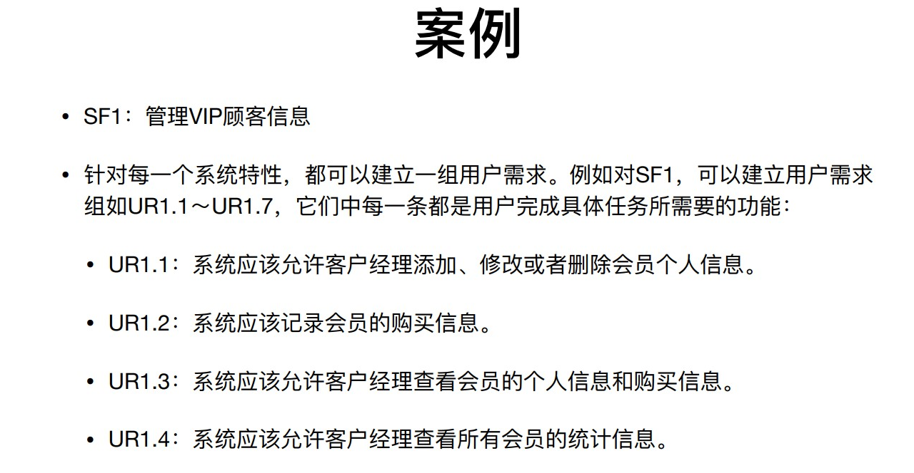
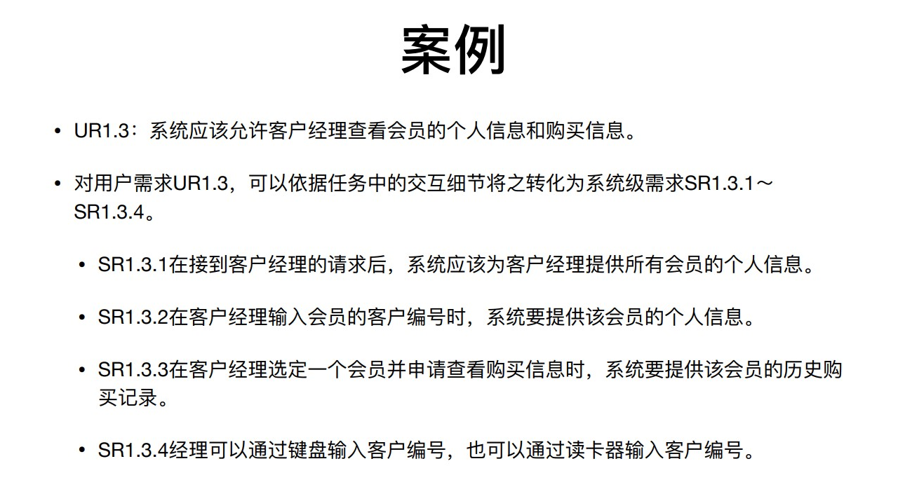

# 软工二

## 需求

#### 一、需求工程

##### • 概念

所有需求处理活动的总和。它**收集**信息、**分析**问题、**整合**观点、**记录**需求并**验证**其正确性，最终描 述出软件被应⽤后与其环境互动形成的**期望效应**

##### • 三个主要任务

 • 需求⼯程必须说明软件系统将被应⽤的应⽤环境及其**目标**，说明⽤来达成这些⽬标的软件功能，也 即要同时说明软件需要**“做什么”和“为什么”**需要做。

 • 需求⼯程必须将⽬标和功能反映到软件系统当中，映射为**可行的软件行为**，并对软件行为进行准确 的规格说明。

 • 现实世界是不断变化的世界，因此需求⼯程还需要妥善处理⽬标和功能随着时间演化的变动情况

#### 二、需求获取

##### • 从人、文档或者环境当中获取需求的过程 

##### • 要利用各种方法和技术来“发现”需求

##### • 目标分析 

​	⑴根据问题确定目标 

​	⑵通过分析利害关系人确定目标

#### 三、需求分析

​	• 通过**建模**来整合各种信息，以使得⼈们更好的理解问题。

​	• 为问题定义出⼀个需求集合，这个集合能够为问题界定⼀个有效的解决⽅ 案。 

​	• 检查需求当中存在的错误、遗漏、不⼀致等各种缺陷，并加以修正

##### • 边界分析

​	• 定义项⽬的范围 

​	• 系统边界的定义要保证系统能够和周围环境形成有效的互动 

​	• 系统⽤例图通常被⽤来定义系统的边界

##### • 需求建模 

​	• 建模是为展现和解释信息⽽进⾏的抽象描述活动

​	• 常⽤的技术包括类图、顺序图、状态图等建模技术

#### 四、需求规格说明

##### • 在系统用户之间交流需求信息

##### • 要简洁、精确、⼀致和易于理解 

##### • 需求⼯程师在这个阶段的重要⼯作包括:

​	• ⼀、定制⽂档模版 

​	• ⼆、编写文档

#### 五、需求验证

##### • 需求规格说明文档至少要满足的标准

​	• ⽂档内每条需求都正确、准确的反映了⽤户的意图； 

​	• ⽂档记录的需求集在整体上具有完整性和⼀致性； 

​	• ⽂档的组织⽅式和需求的书写⽅式具有可读性和可修改性

##### •验证的方法

​	同级评审

​	原型

​	模拟

#### 六、需求

##### 1 业务需求

系统建⽴的战略出发点，表现为高层次的目标（Objective），它描述了组织**为什么要开发系统**，特性说明了系统为用户提供的各项功能，它限定了**系统的范围**

##### 2 用户需求

- 执行实际工作的用户对**系统所能完成的具体任务的期望**，描述了**系统能够帮助用户做些什么**

##### 3 系统需求

- 用户对系统行为的期望，每个系统级需求反映了⼀次外界与系统的交互行为，或者系统的⼀个**实现细节**

- 描述了开发人员需要实现什么

##### 4 功能需求

和系统主要工作相关的需求，即在不考虑物理约束的情况下，用户希望**系统所能够执行的活动**，这些活动可以**帮助用户完成任务**。功能需求主要表现为**系统和环境之间的行为交互**

##### 5 性能需求

系统整体或者系统组成部分应该拥有的性能特征，例如CPU使用率

##### 6 质量需求

系统完成工作的质量，即系统在“好的程度”上实现功能需求，例如可靠性程度

##### 7 对外接口

系统和环境中其他系统之间需要建立的接口，包括硬件接口、软件接口等

##### 8 约束

进行系统构造时需要遵守的约束，是系统的内部实现，例如编程语言、硬件设施、系统必须能够与Oracle数据库交互

##### 9 数据需求

功能需求的补充

例如：系统需要存储1年内的销售记录和退货记录

## 用例

#### 一、用例

定义： 系统(或者子系统或者类)和外部对象的交互当中所执行的行为序列的描述，包括**各种不同的序列和错误的序列**，它们能够联合提供一种有价值的服务

用例描述了在不同条件下系统对 某一用户的**请求的响应**。根据用户的请求和请求时的系统条件,系统将执行**不同的行为序列**, 每⼀ 个行为序列被称为⼀个场景。⼀个用例是多个场景的集合。

#### 二、用例图建立

##### • 目标分析与解决方向的确定 

##### • 寻找参与者 

##### • 寻找用例 

##### • 细化用例

